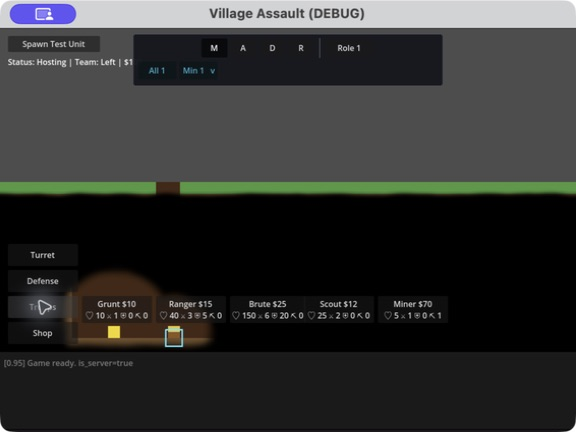
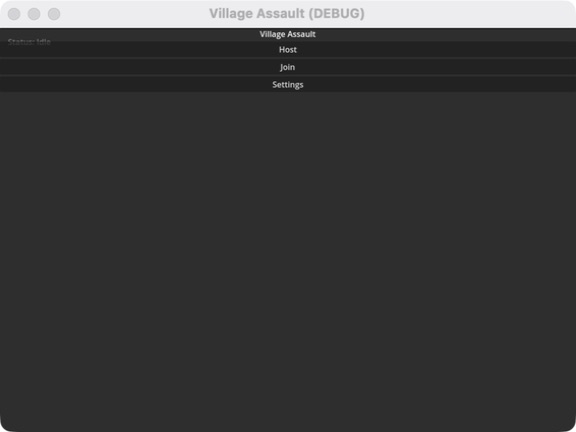
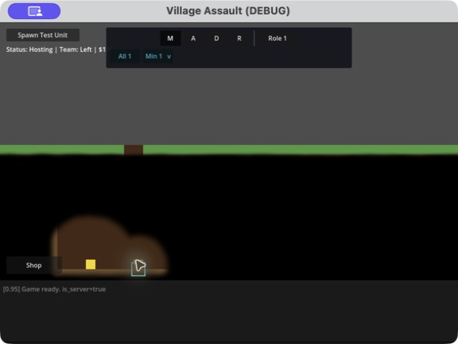

# Village Assault

Village Assault is a two-player, side-view strategy game built with Godot 4 and
GDScript. Each player develops one side of a procedurally generated battlefield,
commands troop formations, excavates underground routes, harvests gold, and pushes
toward the opposing village.



## Gameplay Highlights

- Host-authoritative two-player multiplayer over ENet.
- Seeded, block-based terrain with configurable map dimensions.
- Five troop types: Grunt, Ranger, Brute, Scout, and Miner.
- Click and drag troop selection with type filters and per-unit rosters.
- Move, Advance, Defend, and Retreat tactical orders.
- Footprint-aware movement across tunnels, climbs, and drops.
- Miner jobs for excavating terrain and harvesting discovered gold.
- Team-specific fog of war driven by troop vision and underground connectivity.
- Shop categories for troops, defenses, and turrets.
- Combat using each troop's health, damage, defense, attack interval, and range.
- Mid-game disconnect handling with automatic reconnection and state restoration.

## Requirements

- [Godot 4.5 or newer](https://godotengine.org/download)
- Standard Godot build; .NET is not required.
- Python 3 for the multiplayer test harnesses.

## Run the Game

### Godot Editor

1. Import `./village-assault/project.godot` in Godot.
2. Run the project. The startup scene is
   `res://scenes/boot_menu.tscn`.

### Command Line

From the repository root:

```sh
godot --path ./village-assault
```

Set `GODOT_BIN` when Godot is not available on `PATH`:

```sh
GODOT_BIN=/path/to/Godot ./tools/run_local_multiplayer.sh
```

The local multiplayer launcher opens two independent windows at the main menu. Use the
normal Host and Join controls to exercise the complete flow manually.

## Start a Match



1. Player one selects **Host**, chooses the map size, and starts hosting.
2. Player two selects **Join** and enters the host address. Local sessions default to
   `127.0.0.1`.
3. Both players enter the lobby. The host selects **Start Game** when both sides are
   connected.
4. Purchase troops from the in-game shop. New troops begin in Defend mode until they
   receive another order.

## Controls

| Input | Action |
|---|---|
| Left click a troop | Select the nearest friendly troop |
| Left drag | Box-select friendly troops |
| Shift + left click/drag | Add or remove troops from the current selection |
| Right click | Move active troops when Move is the selected tactical order |
| Right drag | Pan the camera |
| WASD or arrow keys | Pan the camera |
| Mouse wheel, Q/E, + or - | Zoom the camera |
| Command toolbar | Select Move, Advance, Defend, or Retreat |
| Type filter / disclosure | Activate a troop type or open its per-unit roster |
| Role menu | Assign troop-specific jobs such as Dig or Harvest |
| Escape | Pause or resume the match |
| F9 | Simulate a disconnect or reconnect in development builds |

### Tactical Orders

- **Move** sends the active selection toward a right-clicked tile. If the exact tile is
  inaccessible, troops stop at the nearest reachable stand tile.
- **Advance** pushes troops toward the enemy side and allows them to engage targets.
- **Defend** holds the current position while retaining combat behavior.
- **Retreat** disengages troops and routes them toward a valid stand tile at their base.

### Mining and Fog of War



Select one or more miners, open **Role**, and choose **Dig** or **Harvest**. Click or drag
over target tiles, then confirm the job. Dig targets must connect to exposed underground
air. Harvest targets must be discovered ore. Miners can partition grouped work, reveal
terrain around themselves, return harvested gold to their base, and resume their queued
job when appropriate.

Fog is tracked separately for each team. Current troop vision reveals nearby connected
space, while previously explored terrain remains partially visible after troops leave.

## Combat and Economy

Players earn passive income and additional money from mined gold. Shop purchases use the
item's configured cost and spawn troops on the authoritative host. Opposing troops stop
when in range, exchange attacks using their configured stats, and resume their tactical
behavior after combat ends.

The development-only **Spawn Test Unit** button creates a free local grunt without
deducting money. It is intended for debugging combat and replication, not normal play.

## Disconnect and Pause Behavior

- If the client disconnects during a match, the host pauses and waits for reconnection.
  The client can rejoin from the main menu and recover its team, money, scene, terrain,
  and troop visibility.
- If the host disconnects, the client displays a notification and retries the last host
  address every five seconds.
- **Escape** pauses the match for both players. The pausing player receives the pause
  controls; the remote player sees a read-only paused state.

## Project Layout

```text
village-assault/
  scenes/
    boot_menu.tscn       Host/Join menu
    lobby.tscn           Pre-game lobby
    game.tscn            Main game scene
    troops/              Troop scenes and scene-owned visuals
    ui/                   Reusable game UI scenes
  scripts/
    game_state.gd         Teams, money, spawn queue, and reconnect state
    game.gd               Selection, commands, spawning, and game orchestration
    network/              ENet hosting, joining, and reconnection
    troops/               Combat, tactical movement, and miner behavior
    ui/                   Shop, command, mining, pause, and disconnect UI
    world/                Terrain, ore, fog, and pathfinding
    testing/              Deterministic multiplayer test-session support
  test_sessions/          Reusable JSON gameplay scenarios
  tests/                  GdUnit4 unit, scene, and integration coverage
tools/
  run_all_tests.sh        Complete automated verification
  run_local_multiplayer.sh
                          Two main-menu windows for manual testing
  run_reconnect_harness.py
                          Host/client reconnect acceptance harness
  run_test_session.py     Deterministic visual and multiplayer scenarios
```

Four autoloads are registered in `project.godot`:

| Autoload | Purpose |
|---|---|
| `NetworkManager` | ENet peer creation, host/join, disconnect, and reconnection |
| `GameState` | Authoritative teams, money, world settings, spawn queue, and reconnect state |
| `DebugConsole` | In-game development logging below the gameplay viewport |
| `TestHarness` | Deterministic scene and multiplayer orchestration for automated sessions |

## Testing

Run the canonical verification command from the repository root:

```sh
GODOT_BIN=/path/to/Godot ./tools/run_all_tests.sh
```

It runs the complete GdUnit4 suite, game and lobby reconnect harnesses, and the two-peer
grouped-mining acceptance scenario sequentially. Focused test commands and harness
details are documented in [TESTING.md](./TESTING.md), while deterministic scenario
authoring is documented in
[village-assault/test_sessions/README.md](./village-assault/test_sessions/README.md).

## Current Limitations

- Matches currently support exactly two players.
- The Settings screens are placeholders.
- Troops use multiplayer scene replication for spawn, despawn, and reconnect visibility;
  non-troop shop objects still use their existing local behavior.
- Development builds expose the debug console, test spawn button, and F9 network toggle.
