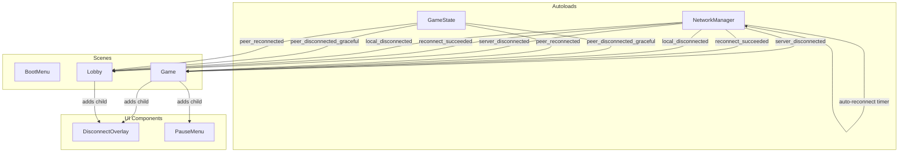

# Design Document: Player Disconnect Handling

## Overview

This design adds graceful disconnect handling, an in-game pause menu, and a debug disconnect tool to Village Assault's 2-player multiplayer game.

The system provides:
- Peer state preservation with an inactive flag instead of erasure
- Indefinite reconnection window (no time limit) managed by the host
- Disconnect notification overlays with differentiated messages (intentional leave vs network disconnect)
- Automatic reconnection attempts (client→host every 5s)
- Game pause during disconnection to prevent unfair advantage
- ESC pause menu with server-authoritative pause/unpause RPCs
- F9 debug disconnect toggle for testing
- Scene redirect RPC so reconnecting clients land on the correct scene
- Session reset (`reset_all()`) when hosting a new game

All authoritative state lives on the host (server). The client displays UI and attempts reconnection. No new autoloads are introduced — changes are scoped to `GameState`, `NetworkManager`, scene scripts (`game.gd`, `lobby.gd`, `boot_menu.gd`), and new UI components (`DisconnectOverlay`, `PauseMenu`).

## Architecture



### Disconnect Flow (Client disconnects)

1. ENet detects peer loss → `multiplayer.peer_disconnected` fires on host
2. `GameState._on_peer_disconnected` marks peer inactive, emits `peer_disconnected_graceful`
3. Game scene pauses tree, shows DisconnectOverlay ("The Client disconnected" or "The Client has left")
4. Host waits indefinitely for client to reconnect
5. On reconnect: `try_restore_peer` maps new peer ID → old state, sends restore RPC + scene redirect, emits `peer_reconnected`
6. Game scene unpauses, hides all overlays

### Disconnect Flow (Host disconnects)

1. ENet detects server loss → `multiplayer.server_disconnected` fires on client
2. Game scene pauses tree, shows DisconnectOverlay, starts auto-reconnect (every 5s)
3. Client can return to menu or wait for host to come back
4. On reconnect: `reconnect_succeeded` fires, game unpauses, overlay hidden

### Pause Flow (ESC)

1. Player presses ESC → sends pause request RPC through host
2. Host broadcasts `_set_paused(true, pauser_id)` to both peers
3. Pauser sees PauseMenu (Settings, Main Menu, Back), other player sees "The other player has paused the game"
4. ESC again or Back → unpause RPC broadcast
5. Main Menu → `_notify_leaving` RPC (so other player sees "left" not "disconnected"), then disconnect

### F9 Debug Flow

1. F9 while connected → `simulate_disconnect()`: closes ENet peer, manually triggers `_on_peer_disconnected` for remote peers (host only), emits `local_disconnected`
2. F9 while disconnected → re-host (if was host) or `attempt_reconnect()` (if was client)

## Components and Interfaces

### 1. GameState Changes (game_state.gd)

New signals:
```gdscript
signal peer_disconnected_graceful(peer_id: int)
signal peer_reconnected(peer_id: int)
```

New state:
```gdscript
var current_scene: String = "boot_menu"  # Set by scene scripts for reconnect routing
var _inactive_peers: Dictionary = {}     # peer_id -> { team, money, disconnect_time }
var _disconnected_peer_id: int = -1
```

Key methods:
- `_on_peer_disconnected(peer_id)` — Moves data to `_inactive_peers`, emits `peer_disconnected_graceful`
- `try_restore_peer(new_peer_id) -> bool` — Restores from `_inactive_peers`, sends scene redirect RPC, emits `peer_reconnected`
- `clear_inactive_peer(peer_id)` — Erases from `_inactive_peers`, resets `_disconnected_peer_id`
- `reset_all()` — Clears all session data for new game
- `_on_host_started()` — Detects re-host (peer 1 already in `_peer_team`) and skips world settings broadcast to prevent terrain rebuild/camera jump
- `_receive_scene_redirect(scene_name)` — RPC that tells reconnecting client which scene to load
- `_count_team()` — Counts both active and inactive peers' teams

### 2. NetworkManager Changes (network_manager.gd)

New state:
```gdscript
var _last_host_address: String = ""
var _last_host_port: int = DEFAULT_PORT
var _last_host_max_clients: int = DEFAULT_MAX_CLIENTS
var _was_host: bool = false
var _auto_reconnect_timer: Timer = null
var _is_reconnecting: bool = false
```

New signals:
```gdscript
signal reconnect_attempted
signal reconnect_succeeded
signal reconnect_failed
signal local_disconnected
```

Key methods:
- `attempt_reconnect()` — Cleans up stale peer, sets `_is_reconnecting`, calls `join()`
- `start_auto_reconnect(interval)` / `stop_auto_reconnect()` — Timer-based retry
- `simulate_disconnect()` — Closes ENet peer, manually triggers `_on_peer_disconnected` for remote peers (critical: must happen before nulling multiplayer peer), emits `local_disconnected`
- F9 `_unhandled_input` handler — Toggle disconnect/reconnect, role-aware (re-host vs rejoin)
- `process_mode = ALWAYS` — So F9 works while tree is paused

### 3. DisconnectOverlay (scenes/ui/disconnect_overlay.tscn)

A `CanvasLayer` overlay with `process_mode = ALWAYS`:
- Message label + "Main Menu" button
- All intermediate containers have `mouse_filter = IGNORE` so the debug console remains clickable
- Background stops 160px from bottom to not cover debug console

Methods:
```gdscript
func show_self_disconnected() -> void   # "You have disconnected. Reconnecting..."
func show_client_left() -> void         # "The Client has left the game."
func show_client_disconnected() -> void # "The Client disconnected."
func show_host_left() -> void           # "The Host has left the game."
func show_host_disconnected() -> void   # "The Host disconnected."
func hide_overlay() -> void
```

### 4. PauseMenu (scenes/ui/pause_menu.tscn)

A `CanvasLayer` overlay with `process_mode = ALWAYS`:
- Settings button (placeholder), Main Menu button, Back button
- Handles ESC key directly via `_unhandled_input` (works while paused)
- Two display modes: `show_pause_menu()` (local pauser) and `show_remote_paused()` (other player)

### 5. Game Scene Changes (game.gd)

- Instantiates both DisconnectOverlay and PauseMenu as children
- Connects to: `peer_disconnected_graceful`, `peer_reconnected`, `server_disconnected`, `reconnect_succeeded`, `local_disconnected`
- Tracks `_peer_left_intentionally` flag (set by `_notify_leaving` RPC) to differentiate overlay messages
- Pause menu: ESC → `_request_pause()` → server broadcasts `_set_paused(true, pauser_id)` → both peers pause
- Main Menu from pause: sends `_notify_leaving` RPC, waits 100ms for delivery, then disconnects
- On any reconnect event: hides ALL overlays (both disconnect and pause), unpauses, resets camera

### 6. Boot Menu Changes (boot_menu.gd)

- `class_name BootMenu` with `static var return_status_message` for status on return
- Calls `GameState.reset_all()` then `NetworkManager.host()` then `GameState.set_world_settings()` (order matters: peer must exist before broadcasting)
- Skips lobby redirect when `_is_reconnecting` (host sends scene redirect RPC instead)

## Data Models

### Inactive Peer Record

```gdscript
# Stored in GameState._inactive_peers[peer_id]
{
    "team": int,              # Team.LEFT or Team.RIGHT
    "money": int,             # Money at time of disconnect
    "disconnect_time": float  # Time.get_ticks_msec() when disconnect occurred
}
```

## Correctness Properties

### Property 1: State preservation on disconnect
*For any* peer with a valid team and non-negative money, disconnecting shall retain an inactive record with matching values.
**Validates: Requirements 1.1, 1.2**

### Property 2: Team reservation during inactive state
*For any* inactive peer with a team, new peers shall not be assigned to the same team.
**Validates: Requirements 1.3**

### Property 3: State restoration round-trip
*For any* peer state, disconnecting and reconnecting shall restore the exact same team and money.
**Validates: Requirements 4.1, 4.2**

### Property 4: Fresh state after clearing inactive peer
*For any* cleared inactive peer, a new connection shall receive fresh `STARTING_MONEY`.
**Validates: Requirements 4.4**

### Property 5: State erasure on clear
*For any* inactive peer, `clear_inactive_peer` shall fully erase the record and reset `_disconnected_peer_id`.
**Validates: Requirements 5.2**

### Property 6: Pause/unpause round-trip
*For any* game state, pausing then unpausing shall return the tree to unpaused state.
**Validates: Requirements 7.1, 7.2**

## Known Limitations

1. **Troop state not synced on reconnect**: Spawned units are fire-and-forget RPCs. A reconnecting client won't see troops spawned while disconnected. Fix requires MultiplayerSpawner or a snapshot RPC mechanism.
2. **F9 simulate_disconnect race**: `peer.close()` doesn't reliably fire Godot's `peer_disconnected` callbacks before the peer is nulled. The workaround manually calls `GameState._on_peer_disconnected` for remote peers.

## Error Handling

| Scenario | Handling |
|---|---|
| Client disconnects during scene transition | GameState marks peer inactive; overlay shown once new scene is ready |
| Host calls `simulate_disconnect` | Manually triggers `_on_peer_disconnected` for all remote peers before nulling peer |
| Host re-hosts after F9 | `_on_host_started` detects re-host (peer 1 already in `_peer_team`), skips world settings broadcast to prevent terrain rebuild and camera jump |
| Client reconnects to re-hosted server | `try_restore_peer` finds inactive peer, restores state, sends scene redirect |
| Player leaves via Main Menu while paused | `_notify_leaving` RPC sent before disconnect so other player sees "left" not "disconnected" |
| Overlay blocks debug console | Overlays stop 160px from bottom, all non-button elements have `mouse_filter = IGNORE` |
| ESC while paused | PauseMenu handles ESC directly via `_unhandled_input` with `process_mode = ALWAYS` |
| `set_world_settings` called before `host()` | Fixed: boot menu calls `host()` first, then `set_world_settings()` |
| Stale session data on new game | `GameState.reset_all()` clears all peer data before hosting |
